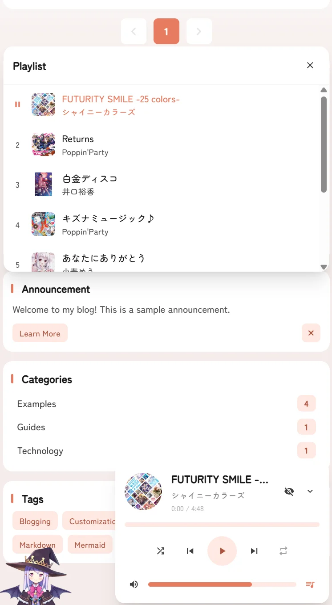

# 🌸 魔改版Astro Mizuki博客 


一个现代化、功能丰富的静态博客模板，基于 [Astro](https://astro.build) 构建，具有先进的功能和精美的设计。


[](https://nodejs.org/)
[](https://pnpm.io/)
[](https://astro.build/)
[](https://www.typescriptlang.org/)
[](https://opensource.org/licenses/Apache-2.0)

[**🖥️ 在线演示**](https://mizuki.mysqil.com/) | [**📝 用户文档**](https://docs.mizuki.mysqil.com/)

[📚 阅读完整文档](https://docs.mizuki.mysqil.com/) →

[原仓库地址](https://github.com/LyraVoid/Mizuki)

- 使用Git推送仓库前请先运行`pnpm check`。
- 使用 mizuki@`9.0` 版本。


<table>
  <tr>
    <td></td>
    <td></td>
    <td></td>
  <tr>
  <tr>
    <td></td>
    <td></td>
    <td></td>
  <tr>
</table>

## ⚡ 命令

所有命令都在项目根目录运行：

| 命令                       | 操作                                    |
|:---------------------------|:---------------------------------------|
| `pnpm install`             | 安装依赖                               |
| `pnpm dev`                 | 在 `localhost:4321` 启动本地开发服务器 |
| `pnpm build`               | 构建生产站点到 `./dist/`               |
| `pnpm preview`             | 在部署前本地预览构建                   |
| `pnpm check`               | 运行 Astro 错误检查                    |
| `pnpm format`              | 使用 Prettier 格式化代码                  |
| `pnpm lint`                | 检查并修复代码问题                     |
| `pnpm new-post <文件名>`   | 创建新博客文章                         |
| `pnpm astro ...`           | 运行 Astro CLI 命令                    |

## 📝 文章前言格式

```yaml
---
title: 文章标题
published:  # 文章发布时间
description:  # 文章描述
image: ./cover.jpg
tags: [""]
category: 
draft: false
pinned: false
encrypted: false  # 是否加密文章
password:  # 设置文章密码，留空则不设置密码
passwordHint:  # 密码提示，留空则不设置提示
alias:  # 文章别名，留空则使用文件名
updated:  # 文章更新时间
---
```

## 🎯 配置指南

### 🔧 基础配置

编辑 `src/config.ts` 自定义您的博客：

```typescript
export const siteConfig: SiteConfig = {
  title: "您的博客名称",
  subtitle: "您的博客描述",
  lang: "zh-CN", // 或 "en"、"ja" 等
  themeColor: {
    hue: 210, // 0-360，主题色调
    fixed: false, // 隐藏主题色选择器
  },
  banner: {
    enable: true,
    src: ["assets/banner/1.webp"], // 横幅图片
    carousel: {
      enable: true,
      interval: 0.8, // 秒
    },
  },
};
```

### 📱 特色页面配置

- **追番页面：** 在 `src/pages/anime.astro` 中编辑动画列表
- **友链页面：** 在 `src/content/spec/friends.md` 中编辑朋友数据
- **日记页面：** 在 `src/pages/diary.astro` 中编辑动态
- **关于页面：** 在 `src/content/spec/about.md` 中编辑内容

### 📦 代码内容分离 (可选)

Mizuki 支持将代码和内容分成两个独立的仓库管理,适合团队协作和大型项目。

**快速选择**:

| 使用场景 | 配置方式 | 适合人群 |
|---------|---------|---------|
| 🆕 **本地模式** (默认) | 不配置,直接使用 | 新手、个人博客 |
| 🔧 **分离模式** | 设置 `ENABLE_CONTENT_SYNC=true` | 团队协作、私有内容 |

**一键启用/禁用**:

```bash
# 方式 1: 本地模式 (推荐新手)
# 不创建 .env 文件,直接运行
pnpm dev

# 方式 2: 内容分离模式
# 1. 复制配置文件
cp .env.example .env

# 2. 编辑 .env,启用内容分离
ENABLE_CONTENT_SYNC=true
CONTENT_REPO_URL=https://github.com/your-username/Mizuki-Content.git

# 3. 同步内容
pnpm run sync-content
```

**功能特性**:
- ✅ 支持公开和私有仓库 🔐
- ✅ 一键启用/禁用,无需修改代码
- ✅ 自动同步,开发前自动拉取最新内容

📖 **详细配置**: [内容分离完整指南](docs/CONTENT_SEPARATION.md)  
🔄 **迁移教程**: [从单仓库迁移到分离模式](docs/MIGRATION_GUIDE.md)  
📚 **更多文档**: [文档索引](docs/README.md)


### Pages 页面加密格式---Markdown

```markdown
---
encrypted: false | true
password: "123456"
---
```

## ✏️ 贡献

我们欢迎贡献！请随时提交问题和拉取请求。

1. Fork 仓库
2. 创建功能分支 (`git checkout -b feature/amazing-feature`)
3. 提交更改 (`git commit -m 'Add some amazing feature'`)
4. 推送到分支 (`git push origin feature/amazing-feature`)
5. 打开拉取请求

## ⭐ Star History

[](https://www.star-history.com/#tb-miao/blog&type=date&legend=top-left)


---

⭐ 如果您觉得这个项目有帮助，请考虑给它一个星标!


